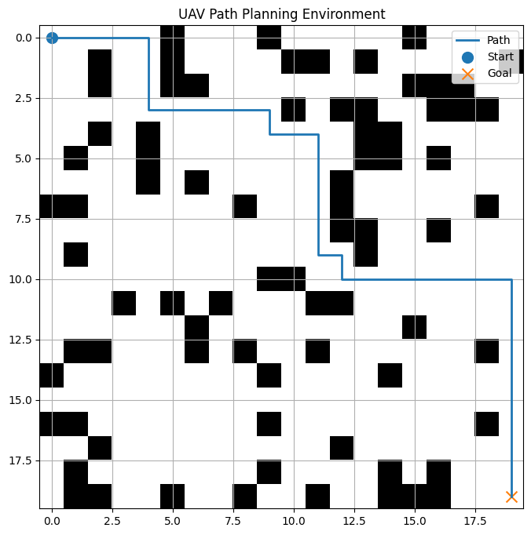
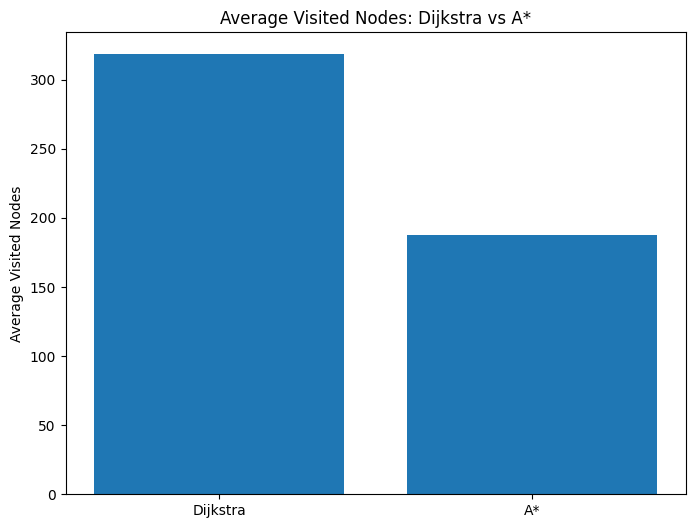
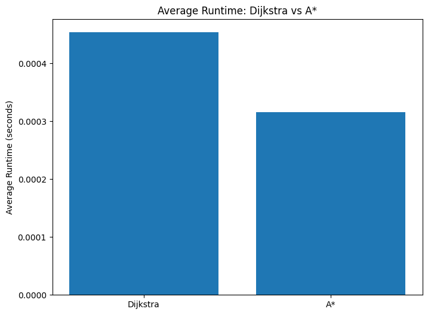

# UAV Path Planning Benchmark

## Overview
This project is a Python-based benchmark for comparing classical path planning algorithms for UAV navigation in grid-based obstacle environments.

The project currently implements:
- Dijkstra
- A*

The environment is generated as a 2D grid with random obstacles, a start point, and a goal point. The algorithms are evaluated using path quality and search-efficiency metrics.

---

## Features
- Random 2D grid environment generation
- Obstacle-based path planning
- Start and goal validation
- Environment visualization
- Path visualization
- Dijkstra implementation
- A* implementation
- Multi-seed experiment pipeline
- JSON-based result logging
- Comparison chart for average visited nodes
- Comparison chart for average runtime

---

## Demo

A short demo video of the project will be added here.

<!-- Replace this line with your video link later -->

---

## Implemented Algorithms

### Dijkstra
Dijkstra explores nodes based only on the real cost from the start node.

### A*
A* uses both:
- real cost from the start (`g_cost`)
- estimated cost to the goal (`heuristic`)

This helps A* search more efficiently than Dijkstra in the current benchmark.

---

## Current Results

### Single-map comparison
For the 20x20 environment with obstacle ratio 0.2 and seed 42:

- Dijkstra:
  - path found: True
  - path length: 39
  - path cost: 38
  - visited nodes: 317

- A*:
  - path found: True
  - path length: 39
  - path cost: 38
  - visited nodes: 227

### Multi-seed comparison
Across 5 randomized environments:

- Dijkstra average:
  - total runs: 5
  - success count: 5
  - average path length: 39.0
  - average path cost: 38.0
  - average visited nodes: 318.4
  - average runtime seconds: 0.00045384

- A* average:
  - total runs: 5
  - success count: 5
  - average path length: 39.0
  - average path cost: 38.0
  - average visited nodes: 187.4
  - average runtime seconds: 0.00031638

### Key Conclusion
Both Dijkstra and A* achieved the same path quality and 100% success rate in the tested benchmark. However, A* required significantly fewer visited nodes and also achieved a lower runtime on average. This shows that A* is more search-efficient than Dijkstra for the current UAV path planning benchmark.

---

## Example Figures

### A* Path Example


### Average Visited Nodes Comparison


### Average Runtime Comparison


---

## Project Structure

```text
uav-path-planning-benchmark/
│
├── README.md
├── requirements.txt
├── main.py
├── .gitignore
│
├── src/
│   ├── environment.py
│   ├── visualization.py
│   ├── metrics.py
│   └── planners/
│       ├── __init__.py
│       ├── dijkstra.py
│       └── astar.py
│
├── experiments/
│   └── basic_test.py
│
├── outputs/
│   ├── figures/
│   └── logs/
│
└── notes/

```

---

## How to Run

### Run single-map comparison
```bash
python main.py
```

### Run multi-seed comparison
```bash
python -m experiments.basic_test
```

---

## Output Files

### Figures
Saved in:

```text
outputs/figures/
```

Examples:
- `astar_path.png`
- `dijkstra_path.png`
- `dijkstra_astar_average_visited_nodes.png`
- `dijkstra_astar_average_runtime.png`

### Logs
Saved in:

```text
outputs/logs/
```

Examples:
- `astar_results.json`
- `dijkstra_results.json`
- `dijkstra_astar_comparison.json`
- `dijkstra_astar_multiple_seeds.json`

---

## Future Work
- Add more planning algorithms
- Extend to dynamic obstacle environments
- Add smoother trajectory generation
- Add demo video for project presentation
- Extend benchmarking to more complex UAV scenarios

---

## Author
Path planning and algorithm benchmarking project.